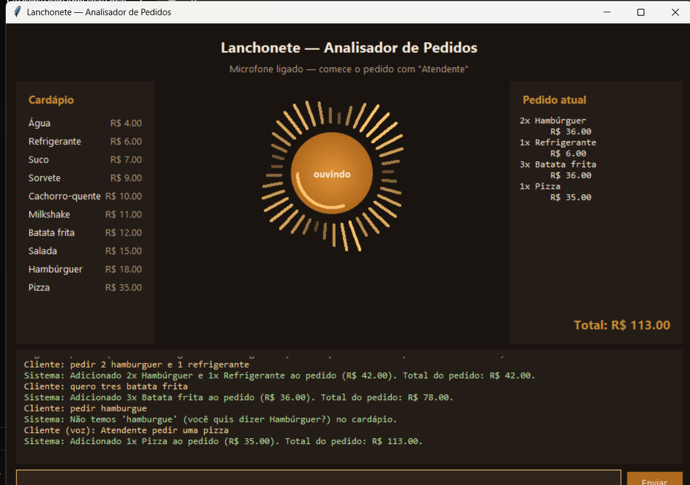

# Analisador de Pedidos da Lanchonete

Projeto da disciplina de **Compiladores** (8º período — UNA). Analisa pedidos de
uma lanchonete em linguagem natural, identificando ação, produto e quantidade por
análise léxica e validando o pedido por análise semântica — ver
[enunciado.md](enunciado.md).

**Repositório:** https://github.com/Kauhan33/projeto-python-compiladores



## Como funciona

1. **Análise léxica** ([lexer.py](lexer.py)): quebra a frase em `Token`s classificados
   em `ACAO`, `PRODUTO`, `QUANTIDADE`, `CONECTIVO` (artigos, preposições) ou
   `DESCONHECIDO`. Reconhece produtos escritos com mais de uma palavra ("batata frita",
   "cachorro quente") e apelidos ("refri", "hot dog", "fritas").
2. **Análise semântica** ([semantic.py](semantic.py)): descobre a qual produto cada
   quantidade se refere, valida o pedido diante do **estado atual** do carrinho e
   calcula os totais.
3. **Cardápio** ([cardapio.py](cardapio.py)): fonte única de produtos, preços e
   apelidos — usada pelo lexer, pela semântica e pela interface.
4. **Execução** ([main.py](main.py)): laço interativo, com um modo `--demo`.
5. **Voz** ([voice.py](voice.py) + [wakeword.py](wakeword.py)) *(opcional)*: transcreve
   o pedido falado e responde em áudio, em pt-BR.
6. **Interface gráfica** ([gui.py](gui.py) + [visual.py](visual.py)) *(opcional)*:
   cardápio, microfone animado e pedido atual na mesma tela.

## O que a análise semântica resolve

A fase léxica reconhece as palavras; é a semântica que entende o **significado** da
sequência. Três exemplos:

**1. A qual produto cada quantidade pertence**

```
Cliente: pedir 2 hamburguer e 1 refrigerante
Sistema: Adicionado 2x Hambúrguer e 1x Refrigerante ao pedido (R$ 42.00). Total: R$ 42.00.
```

A ordem dos tokens é o que diz quem pertence a quem. Em "2 hambúrguer e refrigerante",
o 2 vale só para o hambúrguer — o refrigerante fica com 1.

**2. Validação diante do estado atual do pedido**

```
Cliente: pedir 2 hamburguer
Cliente: remover 5 hamburguer
Sistema: Removido 2x Hambúrguer (você pediu 5, mas tinha 2). Pedido vazio.
```

Remover o que não foi pedido, ou mais do que existe, não é erro de escrita — é um
pedido que só não faz sentido *naquele contexto*.

**3. Erro de digitação vira sugestão**

```
Cliente: pedir hamburgue
Sistema: Não temos 'hamburgue' (você quis dizer Hambúrguer?) no cardápio.
```

## Comandos

| Comando | O que faz |
|---|---|
| `pedir <qtd> <produto>` | põe itens no pedido (também: adicionar, quero, coloca) |
| `remover <qtd> <produto>` | tira itens do pedido (também: tirar, excluir, retirar) |
| `mostrar` | mostra o pedido atual (também: ver, listar) |
| `cardapio` | lista produtos e preços (também: menu, precos) |
| `finalizar` | fecha a conta (também: concluir, fechar) |
| `cancelar` | esvazia o pedido (também: limpar) |
| `ajuda` | lista todos os comandos (também: comandos, help) |
| `sair` | encerra o programa |

A quantidade pode ser número (`2`) ou por extenso (`dois`), e vários itens cabem na
mesma frase. Dentro do programa, `ajuda` imprime a lista completa — montada a partir do
vocabulário real do lexer, então ela nunca fica desatualizada.

## Como executar

```bash
python main.py            # modo interativo (digitado)
python main.py --gui      # interface gráfica (ou: python gui.py)
python main.py --demo     # roda pedidos de exemplo, incluindo erros propositais
```

Para usar voz, instale as dependências extras:

```bash
pip install -r requirements.txt
```

## Interface gráfica

Feita só com **tkinter**, da biblioteca padrão. A tela mostra as três coisas que
importam num balcão ao mesmo tempo: o **cardápio** com os preços, o **microfone** e o
**pedido atual** com o total, que se atualiza a cada comando.

- O **círculo central** gira continuamente e funciona como botão: clicar liga o
  microfone, clicar de novo desliga.
- As **barras ao redor** mostram o volume real captado — cada barra é um instante do
  histórico recente, então o anel é a forma de onda do que o microfone ouviu.

## Voz

- **Falando**, o pedido precisa começar com a palavra-chave **"Atendente"** (ex.:
  "Atendente, pedir dois hambúrgueres") e a resposta sai em áudio. Com o microfone
  aberto num balcão, quase tudo que se capta é conversa: a palavra-chave é o que separa
  pedido de conversa. Variações de transcrição errada do nome ("Atendent", "Atendendo",
  "a tendente") são aceitas por similaridade aproximada, calibrada para não confundir
  com o vocabulário da lanchonete.
- **Digitando**, não precisa de palavra-chave e a resposta sai só na tela.

A resposta em áudio tenta primeiro uma voz pt-BR instalada no sistema e, se não houver,
usa o Google Text-to-Speech — assim sai em português mesmo em máquina sem voz instalada.

## Funciona em qualquer computador?

Sim. O núcleo do exercício (análise léxica + semântica + cardápio) usa **apenas a
biblioteca padrão do Python**. Sem microfone, sem as bibliotecas de voz, sem internet ou
sem tkinter, o programa avisa e continua funcionando pelo teclado.

## Testes

```bash
python -m unittest discover -p "test_*.py" -v
```

São 63 testes:

| Arquivo | Cobre |
|---|---|
| `test_lanchonete.py` | lexer, associação de quantidades, validações, consultas e cardápio |
| `test_voz_e_interface.py` | palavra-chave, síntese de voz e a janela |
